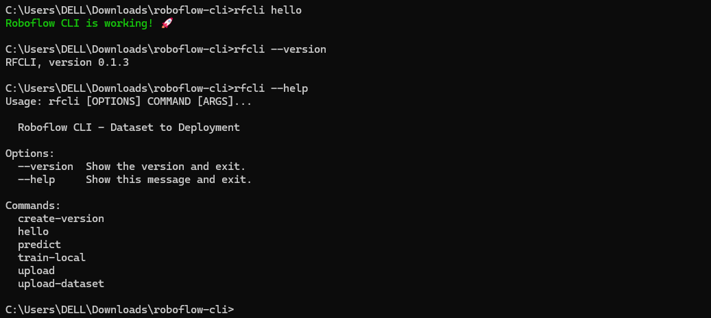
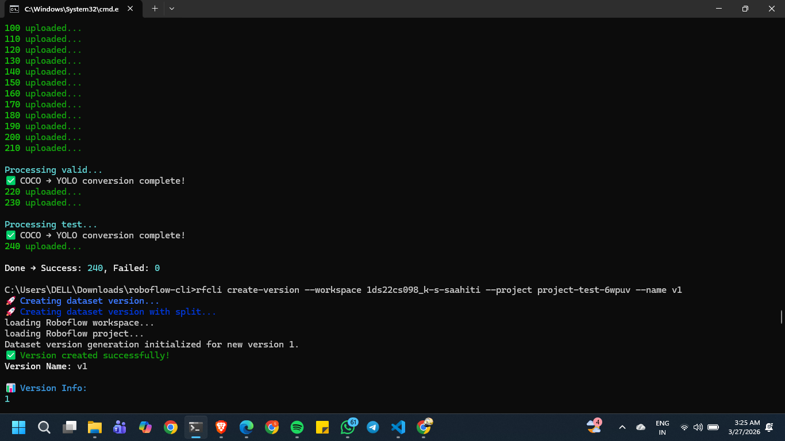
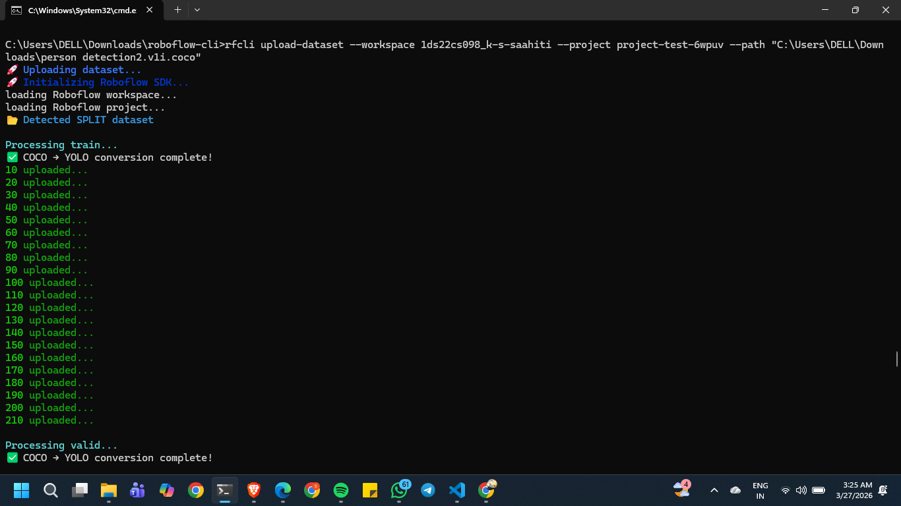
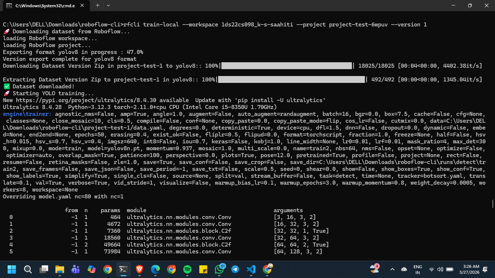
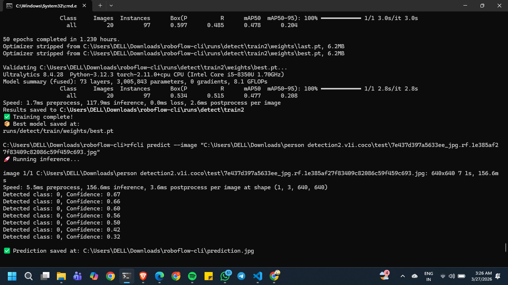

#  RFCLI — End-to-End CLI for Object Detection Pipelines

RFCLI is a production-ready command-line tool that automates the complete lifecycle of an object detection system — from dataset ingestion to model training and inference.

It integrates seamlessly with Roboflow and Ultralytics YOLOv8, enabling developers to manage datasets, version them, train models, and run predictions — all from a single CLI.

---

##  Features

*  Upload datasets to Roboflow (supports multiple formats)
*  Automatic COCO → YOLO conversion
*  Handles flat, split (train/valid/test), and JSON datasets
*  Dataset versioning with configurable splits
*  Train YOLOv8 models locally
*  Run inference on images from CLI
*  Lightweight installation with optional ML dependencies
*  Modular architecture (CLI + API ready)

---

## 🛠️ Tech Stack

* Python
* Roboflow API
* Ultralytics YOLOv8
* Click (CLI framework)
* FastAPI (API support)
* OpenCV

---

##  Installation

###  Basic CLI (lightweight)

```bash
pip install rfcli
```

###  Full ML support (required for training & prediction)

```bash
pip install rfcli[ml]
```

---

##  Setup

Before using RFCLI, set your Roboflow API key:

### Windows (CMD)

```bash
setx ROBOFLOW_API_KEY your_api_key
```

### Linux / Mac

```bash
export ROBOFLOW_API_KEY=your_api_key
```

 Restart your terminal after setting the API key.

---

##  Usage

###  Upload Dataset

```bash
rfcli upload-dataset --workspace <workspace> --project <project> --path <dataset_path>
```

Supports:

* COCO JSON datasets
* YOLO format datasets
* Split datasets (train/valid/test)

---

###  Create Dataset Version

```bash
rfcli create-version --workspace <workspace> --project <project> --name v1
```

Automatically:

* Splits dataset (train/valid/test)
* Applies preprocessing
* Prepares training-ready version

---

###  Train Model

```bash
rfcli train-local --workspace <workspace> --project <project> --version <version_number>
```

* Downloads dataset from Roboflow
* Trains YOLOv8 model locally
* Saves best model weights

---

###  Run Prediction

```bash
rfcli predict --image <image_path>
```

Output:

* Detected classes and confidence scores
* Annotated image saved as `prediction.jpg`

---

## 📁 Supported Dataset Formats

RFCLI automatically detects and handles:

* 📦 COCO JSON format
* 📁 YOLO format (images + labels)
* 📂 Split datasets (train/valid/test folders)
* 📁 Flat datasets

---

##  Demo / Output

###  CLI Commands

```
rfcli --help
```

Available commands:

* upload-dataset
* create-version
* train-local
* predict
* upload
* hello





---

###  Dataset Upload


---

###  Model Training(local)



---

###  Prediction Output



---

##  End-to-End Pipeline

```
Upload → Version → Train → Predict
```

Run everything via CLI:

```bash
rfcli upload-dataset ...
rfcli create-version ...
rfcli train-local ...
rfcli predict ...
```

---

##  Architecture

```
CLI (Click)
   ↓
Core Logic (Upload, Convert, Train, Predict)
   ↓
Roboflow API + YOLOv8
```

* Modular design
* Lazy dependency loading
* Production-ready packaging

---

##  Highlights

* Built as a **pip-installable CLI tool**
* Supports **optional ML dependencies** to reduce install size
* Designed with **real-world MLOps workflow in mind**

---
